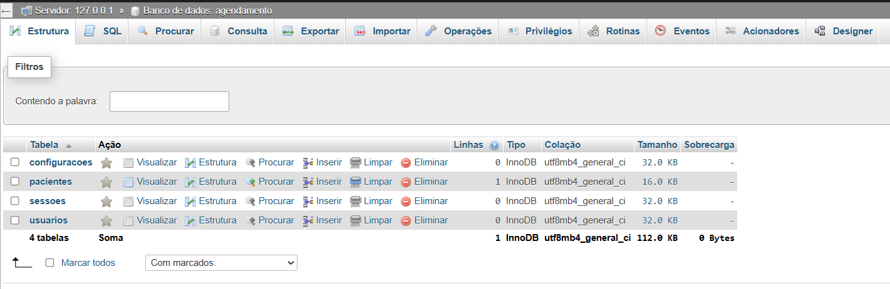
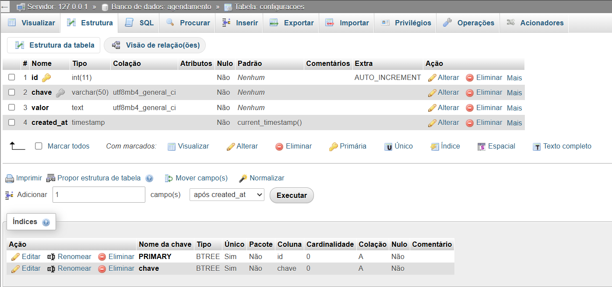
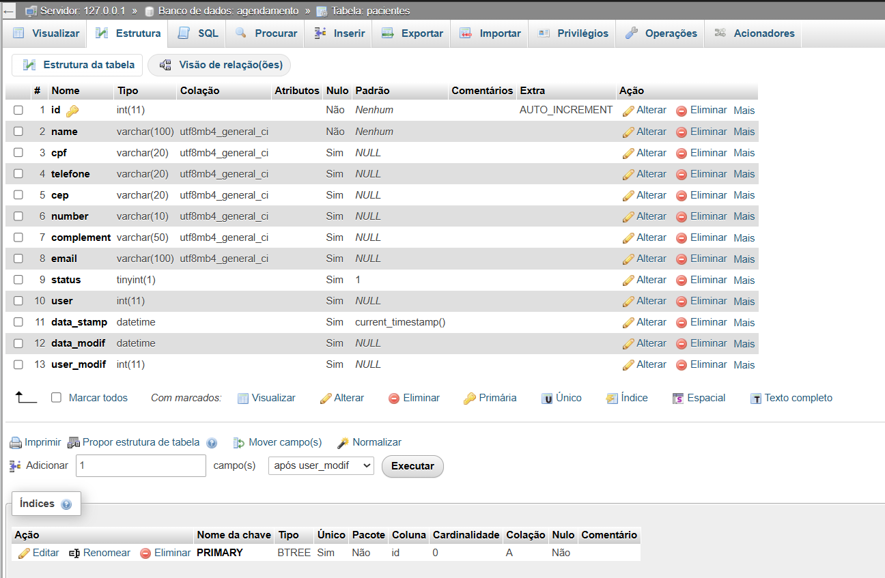
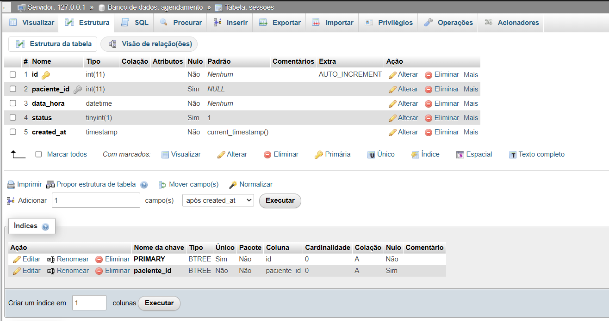
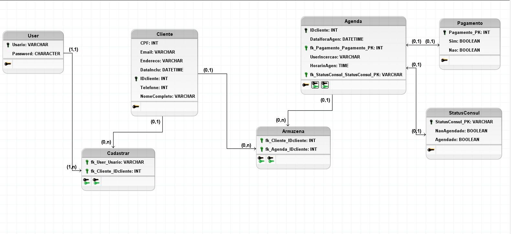
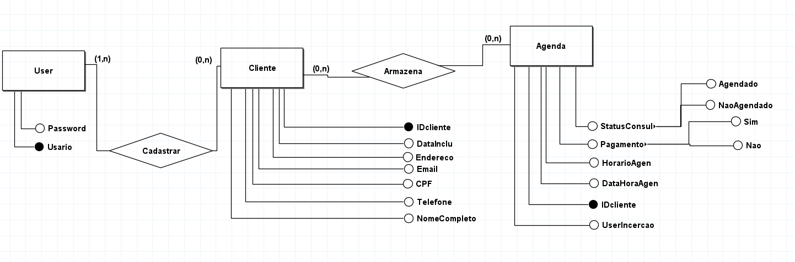

# BANCO DE DADOS

#### LINKS ÚTEIS

| `Links`                                                      | `Descrição`              |
| ------------------------------------------------------------ | ------------------------ |
| [Xampp](https://www.apachefriends.org/pt_br/index.html)      | Software XAMPP           |
| [MySQL](https://dev.mysql.com/doc/)                          | Documentação MySQL       |
| [MySQL Workbench](https://www.mysql.com/products/workbench/) | Software MySQL Workbench |

#### DESCRIÇÃO

Este diretório `path: .\database\` contém os arquivos relacionados ao `SCHEMA` banco de dados __agendamento__. Ele inclui scripts de criação de banco de dados, tabelas e comandos como `CREATE`, `INSERT`, `SELECT` e `DELETE`.

#### OBJETIVO

O objetivo principal é fornecer uma base de dados robusta e eficiente para armazenar e gerenciar informações relacionadas aos agendamentos como configuracoes, pacientes, sessoes e usuarios do sistema.

#### BANCO DE DADOS & TABELAS

| `database` | agendamento   |
| ---------- | ------------- |
| `tabela 1` | configuracoes |
| `tabela 2` | pacientes     |
| `tabela 3` | sessoes       |
| `tabela 4` | usuarios      |

Expandir imagem estrutura database agendamentos

Expandir tabela configuracoes

| `tabela`   | configuracoes | type      |
| ---------- | ------------- | --------- |
| `column 1` | id            | integer   |
| `column 2` | chave         | varchar   |
| `column 3` | valor         | text      |
| `column 4` | created_at    | timestamp |

Expandir imagem estrutura tabela configuracoes

 

Expandir tabela pacientes

| `tabela`    | pacientes  | type     |
| ----------- | ---------- | -------- |
| `column 1`  | id         | integer  |
| `column 2`  | name       | varchar  |
| `column 3`  | cpf        | varchar  |
| `column 4`  | telefone   | varchar  |
| `column 5`  | cep        | varchar  |
| `column 6`  | number     | varchar  |
| `column 7`  | complement | varchar  |
| `column 8`  | email      | varchar  |
| `column 9`  | status     | boolean  |
| `column 10` | user       | integer  |
| `column 12` | data_stamp | datetime |
| `column 13` | data_modif | datetime |
| `column 14` | user_modif | integer  |

Expandir imagem estrutura tabela pacientes

 

Expandir tabela sessoes

| `tabela`   | sessoes     | type      |
| ---------- | ----------- | --------- |
| `column 1` | id          | integer   |
| `column 2` | paciente_id | integer   |
| `column 3` | data_hora   | datetime  |
| `column 4` | status      | boolean   |
| `column 5` | created_at  | timestamp |

Expandir imagem estrutura tabela sessoes

 

Expandir tabela usuarios

| `Table`    | usuarios   | type      |
| ---------- | ---------- | --------- |
| `column 1` | id         | integer   |
| `column 2` | nome       | varchar   |
| `column 3` | email      | varchar   |
| `column 4` | senha      | varchar   |
| `column 5` | created_at | timestamp |

Expandir imagem estrutura tabela usuarios

 

#### MODELO LÓGICO

O modelo lógico de banco de dados é uma representação detalhada da estrutura de um banco de dados, que descreve como os dados serão organizados em tabelas, colunas, tipos de dados e relacionamentos. Definindo como as tabelas estão conectadas 
Sendo:
- `1:1`
- `1:N`
- `N:N`

Expandir imagem modelo lógico

#### MODELO CONCEITUAL

O modelo conceitual de banco de dados é uma representação abstrata e de alto nível que descreve os dados e seus relacionamentos de forma independente de qualquer sistema de gerenciamento de banco de dados (SGBD). Ele é usado para capturar os requisitos de negócio e organizar as informações de maneira compreensível para todas as partes interessadas, incluindo analistas, desenvolvedores e usuários finais. 
Mostrando como as entidades estão conectadas, como "Um paciente pode ter várias sessões" e definndo a quantidade de ocorrências em um relacionamento (`1:1`, `1:N`, `N:N`).

##### EXEMPLO ENTIDADE

- Usuarios
- Paciente
- Sessoes

##### EXEMPLO RELACIONAMENTO

- Um usuário pode gerenciar vários pacientes (1:N).
- Um paciente pode ter várias sessões (1:N).

Expandir imagem modelo conceitual

 

[**[ VOLTAR ]**](../README.md) <===> [**[ INICIO ]**](#banco-de-dados)
